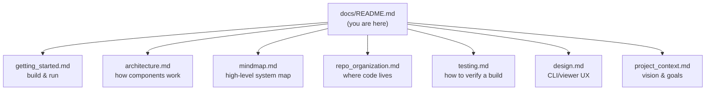

# OpenSplat — System Documentation

**Dev & user documentation for OpenSplat**: what it is, how the pieces fit together, and how to
build, run, and test it. This is *system* documentation — for how agents/contributors *work on*
the project (governance, session ritual, methodology), see `../memory/`.

OpenSplat is a free, open-source C++ implementation of **3D Gaussian Splatting**: it turns posed
images + a sparse point cloud (COLMAP / OpenSfM / OpenMVG / ODM / Nerfstudio) into a `.ply`/`.splat`
scene. It runs on CPU, NVIDIA (CUDA), AMD (HIP/ROCm), and Apple (Metal). See the root
[`../README.md`](https://github.com/SeedeXR/OpenSplat/blob/main/README.md) for the canonical install/build matrix and dataset downloads.

## Map of this folder

## Where to start

| If you want to… | Read |
| --------------- | ---- |
| Build & run OpenSplat | [`getting_started.md`](getting_started.md) → then root [`../README.md`](https://github.com/SeedeXR/OpenSplat/blob/main/README.md) |
| Understand how it works | [`architecture.md`](architecture.md) + [`mindmap.md`](mindmap.md) |
| Find a file / understand the layout | [`repo_organization.md`](repo_organization.md) |
| Verify a build / change | [`testing.md`](testing.md) |
| Understand the CLI/viewer UX | [`design.md`](design.md) |
| Know the project's goals | [`project_context.md`](project_context.md) |

## Documentation index

- [`getting_started.md`](getting_started.md) — prerequisites, build per backend, first run.
- [`architecture.md`](architecture.md) — modules, layers, data flow, backend selection.
- [`mindmap.md`](mindmap.md) — bird's-eye system map and training data flow.
- [`repo_organization.md`](repo_organization.md) — `src/` layout, build invariants, verification.
- [`testing.md`](testing.md) — smoke/build verification and (planned) test harness.
- [`design.md`](design.md) — command-line & visualizer UX standards.
- [`project_context.md`](project_context.md) — vision, objectives, constraints, success metrics.

## Conventions

- Diagrams are **Mermaid** so they render on GitHub.
- Code/build snippets are real and runnable; no invented flags (cross-checked against
  `../README.md` and `../CMakeLists.txt`).
- Dates are absolute (`YYYY-MM-DD`).
- Documentation standards live in `../memory/operating/docs.md`.
