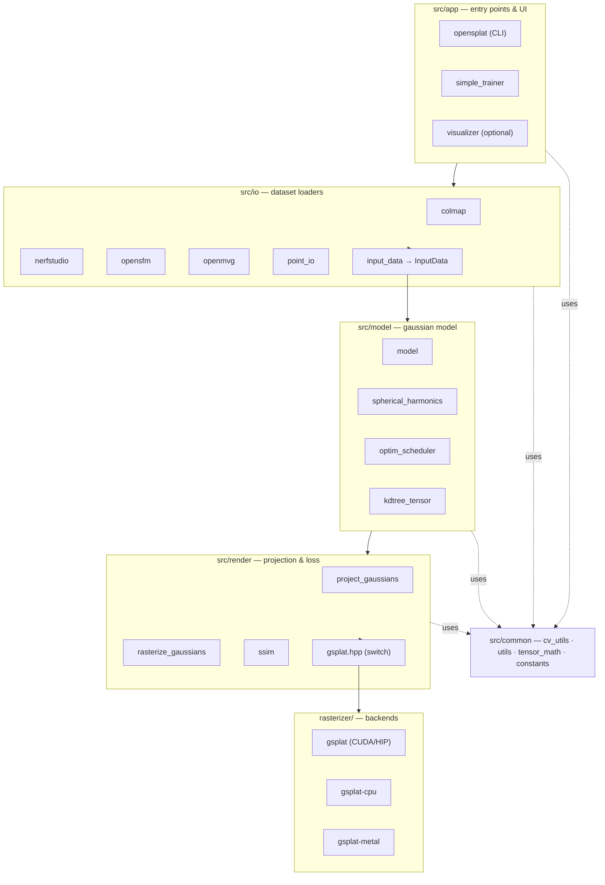
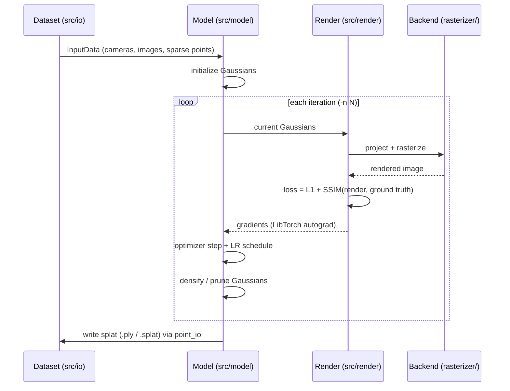
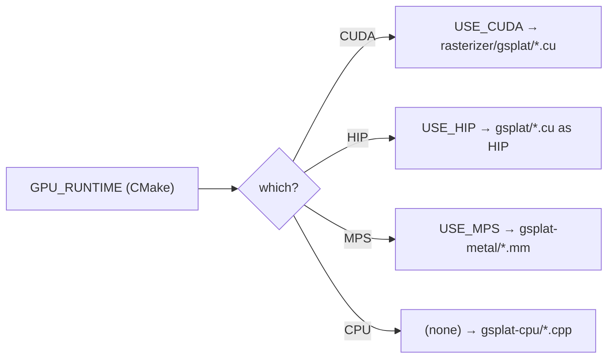

# Architecture

In-depth view of how OpenSplat's components work and interact. Grounded in the current source
tree (`src/`, `rasterizer/`). For the file-location map see
[`repo_organization.md`](repo_organization.md); for the bird's-eye view see [`mindmap.md`](mindmap.md).

## 1. Overview

OpenSplat trains a **3D Gaussian Splatting** model from posed images and a sparse point cloud
(typically SfM output), then renders novel views. It is built on **LibTorch** (tensors +
autograd) with a pluggable rasterizer backend (CPU, CUDA, HIP, Metal).

## 2. Layered structure

## 3. Component responsibilities

### 3.1 Application — `src/app`
- `opensplat.cpp/.hpp` — main CLI (cxxopts): args, dataset selection, training-loop driver, output.
- `simple_trainer.cpp` — minimal standalone trainer (`OPENSPLAT_BUILD_SIMPLE_TRAINER=ON`).
- `visualizer.cpp/.hpp` — optional Pangolin viewer (`OPENSPLAT_BUILD_VISUALIZER=ON`, `USE_VISUALIZATION`).

### 3.2 IO — `src/io`
Normalizes heterogeneous inputs into a single `InputData` (`input_data.hpp`): `colmap`,
`nerfstudio`, `opensfm`, `openmvg` loaders + `point_io` (point-cloud read/write, splat output).

### 3.3 Model — `src/model`
- `model.*` — Gaussian parameters (means, scales, rotations, opacities, SH); init, densify/prune, step.
- `spherical_harmonics.*` — view-dependent color. `optim_scheduler.*` — LR scheduling.
- `kdtree_tensor.*` — nanoflann KD-tree for nearest-neighbor queries during init/densification.

### 3.4 Render — `src/render`
- `project_gaussians.*` → screen-space projection (`tile_bounds.hpp`).
- `rasterize_gaussians.*` → tiled alpha-blended rasterization. `ssim.*` → loss term.
- `gsplat.hpp` → **backend switch**: includes the right `bindings.h` from `rasterizer/`.

### 3.5 Backends — `rasterizer/`
`gsplat/` (CUDA/HIP `.cu`), `gsplat-cpu/` (`gsplat_cpu.cpp`), `gsplat-metal/`
(`gsplat_metal.mm` + `.metal`, compiled to `default.metallib`).

### 3.6 Common — `src/common`
`cv_utils` (OpenCV), `tensor_math`, `utils`, `constants.hpp`.

## 4. Training data flow

## 5. Backend selection

| `GPU_RUNTIME` | Compile def | Rasterizer source | Target |
| ------------- | ----------- | ----------------- | ------ |
| `CUDA` | `USE_CUDA` | `rasterizer/gsplat/*.cu` | NVIDIA |
| `HIP`  | `USE_HIP`  | `rasterizer/gsplat/*.cu` (as HIP) | AMD/ROCm |
| `MPS`  | `USE_MPS`  | `rasterizer/gsplat-metal/*.mm` | Apple Silicon |
| `CPU`  | (none)     | `rasterizer/gsplat-cpu/*.cpp` | portable (~100× slower) |

## 6. Notes & open questions (Phase 3)

OpenSplat is a native C++/LibTorch application — there is no service/API/database layer, so
those generic architecture dimensions are **N/A** rather than fabricated. Exact densification/
pruning policy and loss weighting live in `src/model/model.cpp` and `src/app/opensplat.cpp` and
will be documented with verified detail during the architecture deep-dive (future architecture deep-dive). Memory note: a single
Gaussian is ~2000 bytes (~2 GB GPU memory per million Gaussians).

> This document records **verified** structure. Performance characteristics and detailed
> algorithm parameters are added only after being read from code or measured — never assumed.
