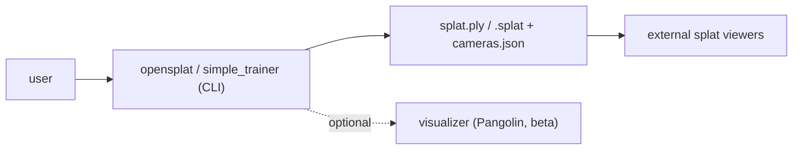

# Design & UX Standards

Single source of truth for OpenSplat's user-facing experience. OpenSplat is a **CLI** tool with
an **optional Pangolin visualizer**, so this covers command-line UX and the viewer — not a
web/app design system. Scope expands if/when a GUI is added.

## Surfaces

## CLI UX principles (HCI heuristics)

- **Visibility of system status:** clear training progress (iteration, loss, ETA); obvious
  start/finish; non-zero exit code on failure.
- **Match the domain:** option names mirror dataset / iterations (`-n`) / output (`-o`).
- **Error prevention & recovery:** validate inputs early (dataset path, sparse points present,
  backend availability); actionable messages.
- **Consistency:** flags, units, and output paths consistent across `opensplat` and
  `simple_trainer`, and consistent with `--help` (cxxopts).
- **Minimal cognitive load:** sensible defaults; the common path needs few flags
  (`./opensplat <dataset> -n 2000`).
- **Help & docs:** `--help` is complete and mirrors [`../README.md`](https://github.com/SeedeXR/OpenSplat/blob/main/README.md) /
  [`getting_started.md`](getting_started.md).

## Visualizer UX

- Responsive; never block the training loop on rendering.
- Clear camera controls; visible status (what's shown, current iteration).
- Degrades gracefully when not built/available — never a hard dependency of training.

## Output & feedback

- Progress: periodic, parseable lines (scriptable), not per-iteration spam.
- Artifacts: predictable filenames/locations; state where results were written.
- States clearly distinguish *running* / *converged-done* / *failed*.

## Accessibility & portability

- Plain-text, color-optional output (respect non-TTY / `NO_COLOR`).
- No reliance on terminal width for correctness.

## Evolving this doc

If a graphical/web UI is introduced, expand into a full design system (tokens, components,
information architecture, responsive behavior) following documentation-first practice. Until then, keep CLI/visualizer
UX consistent and low-friction.
