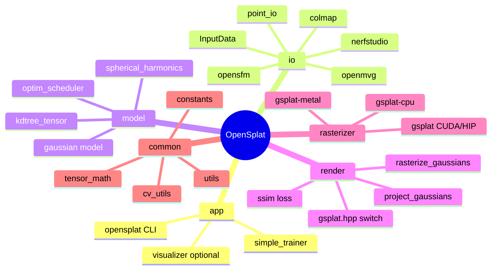
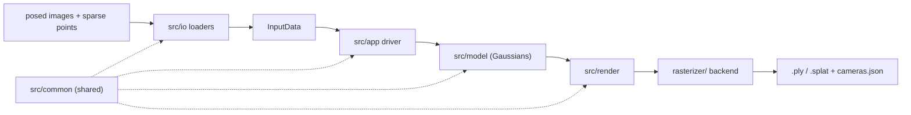
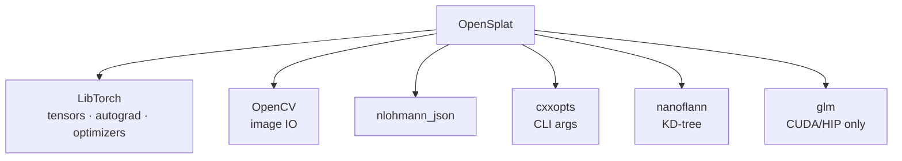

# System Mindmap

High-level map of OpenSplat: modules, dependencies, data flow, and relationships. Detail lives
in [`architecture.md`](architecture.md); file locations in [`repo_organization.md`](repo_organization.md).

## Module mindmap

## How the pieces connect

## External dependencies

`nlohmann_json`, `nanoflann`, `cxxopts`, `glm` are fetched (or `find_package`d) in
`../CMakeLists.txt`. LibTorch + OpenCV are required external installs.

## Training data flow (summary)

`images + sparse points → InputData → initialize Gaussians → {project → rasterize → SSIM/L1 →
backprop → optimizer step → densify/prune} ×N → write splat`. Full sequence in
[`architecture.md`](architecture.md#4-training-data-flow).
