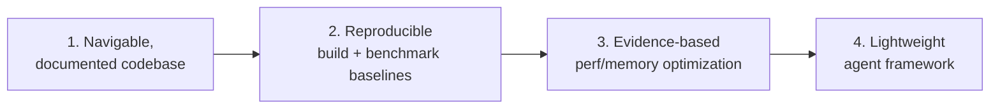

# Project Context

Vision, objectives, deliverables, success metrics, constraints, and evaluation criteria — to
keep contributors and agents aligned. Update when scope or constraints change.

## What OpenSplat is

A production-grade, cross-platform C++ implementation of **3D Gaussian Splatting** —
reconstructing a 3D scene as optimizable Gaussians from posed images (SfM output) and rendering
novel views. Runs on CPU, NVIDIA (CUDA), AMD (HIP/ROCm), and Apple (Metal/MPS). Licensed AGPLv3.

## Vision

A fast, portable, memory-aware Gaussian Splatting trainer that runs well from laptops (incl.
16 GB Apple Silicon) to datacenter GPUs, with reproducible quality and performance.

## Objectives

1. Make the codebase navigable and well-documented (Phase 1 — done).
2. Establish reproducible build + benchmark baselines across backends.
3. Drive **evidence-based** performance/memory optimization (esp. Apple Silicon unified memory)
   without regressing quality.
4. Keep the agent/optimization framework lightweight (< 1 GB RAM, sequential default).

## Target users

Researchers/engineers training & rendering splats; contributors extending loaders/backends/the
model; operators on constrained hardware (16 GB unified memory).

## Constraints

- **Hardware:** primary dev machine is 16 GB Apple Silicon (shared CPU/GPU memory). Aggressive
  parallelism prohibited without profiling evidence.
- **Dependencies:** LibTorch + OpenCV required; backend libs (CUDA/HIP/Metal) per platform.
- **Process:** no auto-PRs/issues ([`../AGENTS.md`](https://github.com/SeedeXR/OpenSplat/blob/main/AGENTS.md)); optimizations require benchmark evidence.

## Success metrics

- Reproducible builds green on all backends in CI after structural changes.
- Documented, reproducible benchmark baselines (runtime, peak RAM, CPU/GPU, thermal).
- Each accepted optimization shows ≥1 of: lower memory, lower runtime, lower CPU, lower GPU,
  better quality at equal cost, or better throughput at equal quality — all evidence-backed.
- Token consumption per task trends down via checkpoint/finding reuse.

## Evaluation criteria

- Reconstruction quality never regresses unnoticed.
- Resource budgets respected.
- Documentation stays in sync with code.

> Project goals from the upstream README (more testing on AMD, speed/memory improvements,
> distributed compute, real-time training viewer, automatic filtering) feed the roadmap.
