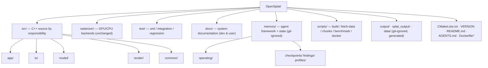

# Repository Organization

Single source of truth for **where things live** in OpenSplat and **why**. Updated whenever the
layout changes. Last reorg: Phase 1 (2026-06-25).

## Goals

1. Group C++ source by **responsibility**, not alphabetically.
2. Keep the build resilient: bare `#include "x.hpp"` keeps working because every `src/`
   subfolder is on the compiler include path in `../CMakeLists.txt`.
3. Separate **product code** (`src/`, `rasterizer/`) from **system docs** (`docs/`) and the
   **agent operating framework** (`memory/`).

## Top-level layout



```
OpenSplat/
├── CMakeLists.txt          # Build. Lists src/ paths; adds src/* to include path.
├── VERSION                 # Read by CMake at configure time.
├── README.md               # Canonical user build & usage docs.
├── AGENTS.md               # Hard rules for AI agents (PR/issue restrictions).
├── Dockerfile*             # Build images (CUDA/ROCm variants). Kept in root: `docker build .`.
├── .github/workflows/      # CI (ubuntu/macos/windows/cuda/rocm/docker).
├── rasterizer/             # GPU/CPU rasterizer backends (UNCHANGED by reorg).
│   ├── gsplat/             #   CUDA / HIP kernels (.cu/.cuh) + bindings.
│   ├── gsplat-cpu/         #   CPU fallback implementation.
│   └── gsplat-metal/       #   Apple Metal implementation (.mm/.metal).
├── src/                    # OpenSplat C++ sources, grouped by responsibility.
│   ├── app/                #   Executables & UI.
│   ├── io/                 #   Dataset / SfM loaders & point-cloud IO.
│   ├── model/              #   Gaussian model & training components.
│   ├── render/             #   Projection & rasterization glue + losses.
│   └── common/             #   Shared math & utility helpers.
├── test/                   # Test suite (unit/ integration/ regression/). Build: -DOPENSPLAT_BUILD_TESTS=ON.
├── scripts/                # build · fetch_test_data · make_chunks · smoke · benchmark · docker-build.
├── docs/                   # System documentation (dev & user) — this folder.
├── memory/                 # Agent operating framework + working state.  ── git-ignored ──
│   ├── operating/          #   Living agent docs (governance, session_start, todo, process_contract, …).
│   ├── agent-registry.yaml #   Ownership & locks.
│   └── checkpoints/ findings/ profiles/
│
└── (generated, git-ignored)
    ├── output/             # Compiled binaries (when built via scripts/build.sh; raw cmake -> build/).
    ├── splat_output/       # Trained splats (.ply/.splat) — run with -o splat_output/<name>.ply.
    └── data/               # Downloaded datasets (scripts/fetch_test_data.sh) + data/chunks/.
```

> **Git-ignored** (not pushed): `memory/`, `output/`, `splat_output/`, `data/`, `build/`.
> `memory/` is the agent's local working brain; the public repo carries code, system docs
> (`docs/`), tests (`test/`), and helper `scripts/`.

## `src/` module map

| Folder | Files | Responsibility |
| ------ | ----- | -------------- |
| `src/app` | `opensplat.*`, `simple_trainer.cpp`, `visualizer.*` | CLI entry points, training driver, optional viewer. |
| `src/io` | `input_data.*`, `colmap.*`, `nerfstudio.*`, `opensfm.*`, `openmvg.*`, `point_io.*` | Read datasets (COLMAP/Nerfstudio/OpenSfM/OpenMVG) + point clouds → `InputData`. |
| `src/model` | `model.*`, `spherical_harmonics.*`, `optim_scheduler.*`, `kdtree_tensor.*` | Gaussian model, SH color, optimizer scheduling, KD-tree. |
| `src/render` | `project_gaussians.*`, `rasterize_gaussians.*`, `ssim.*`, `gsplat.hpp`, `tile_bounds.hpp` | Project/rasterize Gaussians, SSIM loss; `gsplat.hpp` selects the backend. |
| `src/common` | `cv_utils.*`, `utils.*`, `tensor_math.*`, `constants.hpp` | OpenCV helpers, utilities, tensor math, constants. |

## How the build resolves includes after the move

All local includes are **bare quoted** (`#include "model.hpp"`). They keep resolving because
`../CMakeLists.txt` defines `OPENSPLAT_INCLUDE_DIRS` (all five `src/` subfolders) and adds it to
both the `opensplat` and `simple_trainer` targets, alongside `${PROJECT_SOURCE_DIR}/rasterizer`.
**No `#include` statements needed rewriting.** `rasterizer/` was not moved, so its angled
includes (`<gsplat/config.h>`) are unaffected.

## Deliberately NOT moved

- `rasterizer/` — self-contained backend kernels with their own include + CI language detection.
- **Dockerfiles** — kept in root so `docker build .` works and matches `.github/workflows/docker.yml`
  (`file: ./Dockerfile`). Variant selection is wrapped by [`../scripts/docker-build.sh`](https://github.com/SeedeXR/OpenSplat/blob/main/scripts/docker-build.sh).
- `VERSION`, `README.md`, `.github/` — referenced by path or tooling.

## Invariants (do not break)

1. Every `src/` subfolder holding a header **must** be listed in `OPENSPLAT_INCLUDE_DIRS`.
2. Adding a `.cpp` → add it to `OPENSPLAT_SRC_FILES` (or the relevant target).
3. Keep `gsplat.hpp` in `src/render/` — it is the single switch between `rasterizer/` backends.
4. Re-run the verification below after any move.

## Verification

```bash
# 1. Every src/*.cpp referenced in CMakeLists exists:
for p in $(grep -oE 'src/[a-z]+/[a-z_]+\.cpp' CMakeLists.txt | sort -u); do
  test -f "$p" && echo "OK  $p" || echo "MISSING $p"
done
# 2. Every bare-included header resolves on the include path
#    (src/app src/io src/model src/render src/common rasterizer rasterizer/gsplat*).
```

A full compile additionally needs LibTorch + OpenCV; **CI is the authoritative build check**
(this 16 GB Apple Silicon machine may not build every backend). See
[`testing.md`](testing.md) and `../memory/operating/agent_governance.md`.
