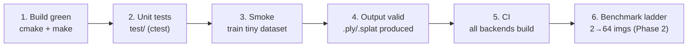

# Testing & Verifying the System

How to verify an OpenSplat build/change actually works. This is the **developer** view (verify
the software). The agent/process testing *methodology* lives in
`../memory/operating/test.md`.

> **Current state (honest):** `test/` is a starter scaffold (unit tests for `tensor_math`,
> off by default). The authoritative checks today are **CI** (`.github/workflows/`, builds
> across backends) + a **smoke run**. Growing the harness + benchmark baselines is tracked in
> `../memory/operating/todo.md` (Phase 2).

## Verification ladder



## 1. Build verification

```bash
scripts/build.sh --libtorch /path/to/libtorch --backend CPU   # or MPS/CUDA/HIP
```

Binaries land in `output/` when built via `scripts/build.sh` (raw `cmake` uses `build/`). A
clean configure + build is the first bar after any structural change. After moving files, confirm build references stay consistent — see the verification
snippet in [`repo_organization.md`](repo_organization.md#verification).

## 2. Unit / integration / regression tests (`test/`)

```bash
scripts/build.sh --libtorch /path/to/libtorch --backend CPU -- -DOPENSPLAT_BUILD_TESTS=ON
ctest --test-dir build --output-on-failure
```

Off by default (`OPENSPLAT_BUILD_TESTS=OFF`). Levels and conventions: [`../test/README.md`](https://github.com/SeedeXR/OpenSplat/blob/main/test/README.md).

## 3. Smoke test (end-to-end)

```bash
scripts/fetch_test_data.sh db/drjohnson          # -> data/db/drjohnson
scripts/smoke.sh data/db/drjohnson 50
```

Trains a few iterations and **fails** if no `.ply`/`.splat` output is produced. Trained splats
go to `splat_output/` (run `opensplat` with `-o splat_output/<name>.ply`).

## 4. CI (authoritative cross-backend)

`.github/workflows/` builds OpenSplat on Ubuntu (CPU/CUDA), macOS, Windows, and ROCm, plus a
Docker build. CI is the source of truth for "does it build everywhere" — a full multi-backend
build is not runnable on a single 16 GB dev machine.

The **test suite runs in CI** on a single matrix cell per OS (GitHub runners are
capacity-limited, so we don't test every torch version): `ubuntu-cpu.yml` builds and runs all
suites incl. integration; `macos.yml` runs the unit + regression suites on **macOS 14
(Apple Silicon)** and skips the heavier integration target. Both reuse the cell's already-built
LibTorch + ccache rather than spawning new jobs.

## 5. Benchmark ladder (Phase 2)

Test data comes from the project's [Hugging Face dataset][hf] (COLMAP scenes). Because
OpenSplat trains on *all* images referenced by a scene's sparse model, valid N-image chunks
are generated with `scripts/make_chunks.py` (pycolmap) — not by copying files:

```bash
scripts/make_chunks.py data/db/drjohnson         # -> data/chunks/drjohnson_{2,4,8,16,32,64}
for d in data/chunks/drjohnson_{2,4,8,16,32,64}; do scripts/benchmark.sh "$d" 2000; done
```

`benchmark.sh` writes runtime / peak RAM / backend to `../memory/profiles/`. **Runtime targets:**
peak RAM ≤ 8 GB (ideal 4–6 GB), no thermal throttling, quality ≥ baseline, all backends green.
Full schema & methodology: `../memory/operating/test.md`.

## What to test when you change…

| Change | Minimum verification |
| ------ | -------------------- |
| Pure logic (math, parsing) | Add/extend a unit test in `test/unit/` |
| A dataset loader (`src/io`) | Build + smoke on a dataset of that format |
| Model / render (`src/model`, `src/render`) | Build + smoke; eyeball output; benchmark vs baseline |
| `CMakeLists.txt` / file moves | `repo_organization.md` snippet + build + CI |
| A rasterizer backend (`rasterizer/`) | Build that backend + smoke; CI covers the others |

[hf]: https://huggingface.co/datasets/alexmkwizu/gaussian_training_datasets
